# Design Document — Lambda Functions MVP

## Overview

This design covers the 9 AWS Lambda functions that power the ADO MobilityIA MVP fleet optimization platform. The system ingests SPN-based simulated telemetry from S3, pivots per-sensor records into consolidated bus state in DynamoDB, and exposes tool functions for two Bedrock AgentCore agents (Fuel Intelligence and Predictive Maintenance) plus a dashboard API.

The Lambdas are organized into four groups:

1. **Telemetry Simulator** (1 Lambda) — Reads raw SPN telemetry from S3, pivots it using the 36-variable SPN catalog, writes consolidated bus state to DynamoDB every 10 seconds.
2. **Fuel Agent Tools** (3 Lambdas) — Query telemetry, calculate fuel deviation, list active buses. Invoked by Bedrock AgentCore Action Groups.
3. **Maintenance Agent Tools** (4 Lambdas) — Query OBD diagnostics, predict mechanical events, search historical fault patterns, generate preventive recommendations. Invoked by Bedrock AgentCore Action Groups.
4. **Dashboard API** (1 Lambda) — Serves fleet status, alerts, consumption summaries, and CO₂ estimates via API Gateway.

All functions share a common Lambda Layer (`ado-common-layer`) containing the SPN catalog loader, telemetry pivot logic, DynamoDB/S3 helpers, and standardized response formatting.

**Key design decisions:**
- **SPN pivot at ingestion time**: Raw telemetry arrives as one row per sensor reading. The simulator pivots these into a single consolidated item per bus per timestamp, storing both flat fields (for DynamoDB queries) and a `spn_valores` map (for detailed agent analysis).
- **Catalog-driven thresholds**: All range checks use `minimo`/`maximo` from the SPN catalog rather than hardcoded values, making the system adaptable if the catalog changes.
- **Heuristic fallback for ML**: The event prediction tool attempts SageMaker first but falls back to a scoring algorithm based on SPN catalog ranges, ensuring the demo works without a trained model.
- **Fuzzy language (C-003)**: Agent-facing responses include qualitative classifications (`EFICIENTE`, `ALERTA_MODERADA`, etc.) that the Bedrock agents translate into natural language without specific numeric metrics.

## Architecture

### High-Level Data Flow

```mermaid
graph TD
    S3_TEL["S3: telemetria-simulada/"]
    S3_CAT["S3: catalogo/motor_spn.json"]
    S3_FAULT["S3: fallas-simuladas/"]
    EB["EventBridge Scheduler<br/>rate(10s)"]
    SIM["ado-simulador-telemetria<br/>(L1)"]
    DDB_TEL["DynamoDB: ado-telemetria-live<br/>PK: autobus, SK: timestamp"]
    DDB_ALE["DynamoDB: ado-alertas<br/>PK: alerta_id, SK: timestamp"]
    LAYER["ado-common-layer<br/>spn_catalog, telemetry_pivot,<br/>dynamo_utils, s3_utils,<br/>constants, response"]

    T1["tool-consultar-telemetria (L2)"]
    T2["tool-calcular-desviacion (L3)"]
    T3["tool-listar-buses-activos (L4)"]
    T4["tool-consultar-obd (L5)"]
    T5["tool-predecir-evento (L6)"]
    T6["tool-buscar-patrones-historicos (L7)"]
    T7["tool-generar-recomendacion (L8)"]
    DASH["ado-dashboard-api (L9)"]

    SM["SageMaker Endpoint<br/>ado-prediccion-eventos"]
    APIGW["API Gateway"]
    FUEL["Bedrock AgentCore<br/>ado-agente-combustible"]
    MAINT["Bedrock AgentCore<br/>ado-agente-mantenimiento"]

    EB -->|triggers| SIM
    S3_TEL -->|reads| SIM
    S3_CAT -->|reads| SIM
    SIM -->|batch_write_item| DDB_TEL

    LAYER -.->|used by| SIM
    LAYER -.->|used by| T1
    LAYER -.->|used by| T2
    LAYER -.->|used by| T3
    LAYER -.->|used by| T4
    LAYER -.->|used by| T5
    LAYER -.->|used by| T6
    LAYER -.->|used by| T7
    LAYER -.->|used by| DASH

    FUEL -->|Action Group| T1
    FUEL -->|Action Group| T2
    FUEL -->|Action Group| T3

    MAINT -->|Action Group| T4
    MAINT -->|Action Group| T5
    MAINT -->|Action Group| T6
    MAINT -->|Action Group| T7

    T1 -->|query| DDB_TEL
    T2 -->|query| DDB_TEL
    T3 -->|query/scan| DDB_TEL
    T4 -->|query| DDB_TEL
    T4 -->|reads| S3_FAULT
    T5 -->|query| DDB_TEL
    T5 -->|invoke| SM
    T5 -->|reads| S3_FAULT
    T6 -->|reads| S3_FAULT
    T7 -->|put_item| DDB_ALE
    T7 -->|query| DDB_TEL

    APIGW -->|routes| DASH
    DASH -->|query| DDB_TEL
    DASH -->|query| DDB_ALE
```



### Lambda Configuration Summary

| Lambda | Memory | Timeout | Trigger | Concurrency |
|--------|--------|---------|---------|-------------|
| `ado-simulador-telemetria` | 512 MB | 30s | EventBridge rate(10s) | 1 |
| `tool-consultar-telemetria` | 256 MB | 10s | Bedrock AgentCore | default |
| `tool-calcular-desviacion` | 256 MB | 10s | Bedrock AgentCore | default |
| `tool-listar-buses-activos` | 256 MB | 10s | Bedrock AgentCore | default |
| `tool-consultar-obd` | 256 MB | 10s | Bedrock AgentCore | default |
| `tool-predecir-evento` | 256 MB | 30s | Bedrock AgentCore | default |
| `tool-buscar-patrones-historicos` | 512 MB | 30s | Bedrock AgentCore | default |
| `tool-generar-recomendacion` | 256 MB | 10s | Bedrock AgentCore | default |
| `ado-dashboard-api` | 256 MB | 15s | API Gateway | default |

### Directory Structure

```
lambda-functions/
├── layers/
│   └── ado-common/
│       └── python/
│           └── ado_common/
│               ├── __init__.py
│               ├── spn_catalog.py        # SPN catalog loader + range checks + constants
│               ├── telemetry_pivot.py    # Pivot per-SPN records → consolidated bus state
│               ├── dynamo_utils.py       # DynamoDB query/write helpers
│               ├── s3_utils.py           # S3 read helpers
│               ├── constants.py          # SPN ID constants, functional groupings
│               └── response.py           # Standard Bedrock AgentCore response format
├── ado-simulador-telemetria/
│   └── lambda_function.py
├── tool-consultar-telemetria/
│   └── lambda_function.py
├── tool-calcular-desviacion/
│   └── lambda_function.py
├── tool-listar-buses-activos/
│   └── lambda_function.py
├── tool-consultar-obd/
│   └── lambda_function.py
├── tool-predecir-evento/
│   └── lambda_function.py
├── tool-buscar-patrones-historicos/
│   └── lambda_function.py
├── tool-generar-recomendacion/
│   └── lambda_function.py
└── ado-dashboard-api/
    └── lambda_function.py
```

## Components and Interfaces

### 1. Common Layer (`ado-common-layer`)

#### `spn_catalog.py`

Loads the SPN catalog from S3 and provides lookup/validation functions.

```python
# Public API
def cargar_catalogo_spn(bucket: str, key: str = "catalogo/motor_spn.json") -> dict[int, dict]:
    """Load SPN catalog from S3, cached via lru_cache. Returns {spn_id: spn_entry}."""

def obtener_spn(catalogo: dict, spn_id: int) -> dict | None:
    """Look up a single SPN entry by ID. Returns {id, name, unidad, minimo, maximo, delta, variable_tipo}."""

def valor_fuera_de_rango(catalogo: dict, spn_id: int, valor: float) -> tuple[bool, str]:
    """Check if value is outside [minimo, maximo]. Returns (is_out_of_range, message)."""

def variacion_anomala(catalogo: dict, spn_id: int, valor_anterior: float, valor_actual: float) -> bool:
    """Detect if variation between consecutive readings exceeds 2x the expected delta."""
```

**Constants defined in module:**
- `SPN_VELOCIDAD = 84`, `SPN_RPM = 190`, ... (all 36 SPN IDs)
- `SPNS_COMBUSTIBLE` — set of 15 fuel-relevant SPN IDs
- `SPNS_MANTENIMIENTO` — set of 19 maintenance-relevant SPN IDs
- `SPNS_DEMO_PRIORITARIOS` — set of 21 priority SPN IDs for the simulator

#### `telemetry_pivot.py`

Transforms per-SPN telemetry records into a consolidated bus state dictionary.

```python
SPN_NOMBRE_CORTO: dict[int, str]  # Maps SPN ID → short field name (e.g., 84 → "velocidad_kmh")

def pivotar_telemetria(
    registros: list[dict],
    catalogo_spn: dict,
    solo_prioritarios: bool = True
) -> dict:
    """
    Pivot per-SPN records into consolidated bus state.
    Returns dict with:
      - Trip context: autobus, viaje_id, operador_cve, operador_desc, viaje_ruta, etc.
      - Flat fields: velocidad_kmh, rpm, temperatura_motor_c, etc.
      - spn_valores: {spn_id_str: {valor, name, unidad, fuera_de_rango}}
      - alertas_spn: [{spn_id, name, valor, unidad, mensaje}]
    """
```

#### `dynamo_utils.py`

```python
def query_latest_records(table_name: str, autobus: str, limit: int = 10) -> list[dict]:
    """Query DynamoDB for latest N records of a bus, sorted by timestamp descending."""

def batch_write_items(table_name: str, items: list[dict]) -> dict:
    """Write multiple items using batch_write_item with retry on unprocessed items."""

def put_item(table_name: str, item: dict) -> dict:
    """Write a single item to DynamoDB."""

def scan_recent(table_name: str, timestamp_limit: str) -> list[dict]:
    """Scan for all items with timestamp > timestamp_limit."""

def query_gsi(table_name: str, index_name: str, pk_value: str, sk_condition: str) -> list[dict]:
    """Query a GSI with partition key and sort key condition."""
```

#### `s3_utils.py`

```python
def read_json_from_s3(bucket: str, key: str) -> dict | list:
    """Read and parse a JSON file from S3."""

def read_parquet_from_s3(bucket: str, key: str) -> list[dict]:
    """Read a Parquet file from S3 and return as list of dicts. Falls back to JSON if pandas unavailable."""

def list_objects(bucket: str, prefix: str) -> list[str]:
    """List object keys under a prefix."""
```

#### `response.py`

```python
def build_agent_response(body: dict, status: str = "success") -> dict:
    """Build response compatible with Bedrock AgentCore Action Group format."""

def build_error_response(message: str, status_code: int = 500) -> dict:
    """Build error response for agent or API Gateway."""

def build_api_response(body: dict, status_code: int = 200) -> dict:
    """Build response for API Gateway with CORS headers."""
```

### 2. Telemetry Simulator (`ado-simulador-telemetria`)

**Trigger:** EventBridge Scheduler at rate(10 seconds)

**Environment variables:**
- `DYNAMODB_TABLE` = `ado-telemetria-live`
- `S3_BUCKET` = `ado-telemetry-mvp`
- `S3_TELEMETRIA_PREFIX` = `hackathon-data/telemetria-simulada/`
- `S3_CATALOGO_KEY` = `hackathon-data/catalogo/motor_spn.json`
- `NUM_BUSES` = `20`

**Execution flow:**
1. Load SPN catalog from S3 (cached across warm invocations via `lru_cache`)
2. For each of the 20 simulated buses:
   a. Compute stateless offset: `(int(time.time()) // 10 + bus_index) % total_records`
   b. Read a block of per-SPN telemetry records from S3 for that bus/offset
   c. Group records by temporal window (~30s)
   d. Call `pivotar_telemetria()` to produce consolidated state
   e. Compute `estado_consumo` using `clasificar_consumo()` (SPN 185 primary, SPN 183 fallback)
   f. Set `ttl_expiry` = current Unix timestamp + 86400
3. Write all 20 bus states via `batch_write_item`
4. Log summary in JSON structured format

**`clasificar_consumo(spn_valores)` logic:**
- SPN 185 (Rendimiento km/L): ≥3.0 → `EFICIENTE`, 2.0–3.0 → `ALERTA_MODERADA`, <2.0 → `ALERTA_SIGNIFICATIVA`
- Fallback SPN 183 (Tasa combustible L/h): ≤30 → `EFICIENTE`, 30–50 → `ALERTA_MODERADA`, >50 → `ALERTA_SIGNIFICATIVA`
- If neither available → `SIN_DATOS`

### 3. Fuel Agent Tools

#### `tool-consultar-telemetria` (L2)

**Input:** `{autobus: str, ultimos_n_registros?: int}` (default 10, max 50)

**Logic:**
1. Query DynamoDB for latest N records (ScanIndexForward=False)
2. For each record, translate `spn_valores` entries to human-readable names using catalog
3. Build `variables_actuales` array with SPN ID, name, value, unit, catalog range, and out-of-range status
4. Build `historial_reciente` array with timestamp, estado_consumo, rendimiento_kml, and count of out-of-range SPNs

**Output:** Bus context + `variables_actuales` + `alertas_activas` + `historial_reciente`

#### `tool-calcular-desviacion` (L3)

**Input:** `{autobus: str, viaje_ruta: str}`

**Logic:**
1. Query last 10 records from DynamoDB
2. Compute averages for SPNs 185, 183, 184
3. Classify deviation: `DENTRO_DE_RANGO` (≥3.0), `DESVIACION_LEVE` (2.5–3.0), `DESVIACION_MODERADA` (2.0–2.5), `DESVIACION_SIGNIFICATIVA` (<2.0)
4. Analyze correlated SPNs for probable causes:
   - SPN 190 avg > 2200 rpm → "RPM above optimal cruise range"
   - SPN 91 avg > 65% → "Frequent harsh acceleration"
   - SPN 84 avg > 100 km/h → "Excessive speed"
   - SPN 521 avg > 25% → "Frequent late braking"
   - SPN 513 avg > 75% → "Sustained high engine load"
   - SPN 523 frequent changes → "Inefficient gear pattern"
   - SPN 527/596 inactive → "Cruise control not used"

**Output:** Efficiency metrics + deviation category + probable causes array

#### `tool-listar-buses-activos` (L4)

**Input:** `{viaje_ruta?: str}`

**Logic:**
1. Compute `timestamp_limit` = now - 5 minutes
2. If `viaje_ruta` provided: Query GSI `viaje_ruta-timestamp-index`
3. If no filter: Scan with FilterExpression on timestamp (acceptable for ~20 buses)
4. For each bus: extract latest record's autobus, viaje_ruta, operador, estado_consumo, count of alertas_spn
5. Sort: `ALERTA_SIGNIFICATIVA` first, then by count of out-of-range SPNs descending

**Output:** List of active buses with status and alert summaries

### 4. Maintenance Agent Tools

#### `tool-consultar-obd` (L5)

**Input:** `{autobus: str}`

**Logic:**
1. Query last 20 records from DynamoDB
2. Extract maintenance-relevant SPNs (`SPNS_MANTENIMIENTO`)
3. Calculate trends: compare first-half vs second-half averages → `estable`, `ascendente`, `descendente`
4. Detect anomalous variations using `variacion_anomala()` (2x delta threshold)
5. Build brake pad status for all 6 positions (SPNs 1099–1104): ≥30% → `aceptable`, <30% → `REQUIERE_ATENCION`
6. Read Data_Fault from S3, filter by autobus, return 5 most recent faults
7. Build `resumen_salud` text summary

**Output:** Mechanical signals with trends + brake pad status + recent faults + health summary

#### `tool-predecir-evento` (L6)

**Input:** `{autobus: str}`

**Logic:**
1. Query last 20 records, build feature vector (averages, max, min per maintenance SPN)
2. Attempt SageMaker endpoint invocation
3. On failure: use heuristic scoring:
   - SPN 110 temp motor: +3 if avg>120°C, +2 if max>140°C
   - SPN 175 oil temp: +2 if avg>130°C
   - SPN 100 oil pressure: +3 if min<150 kPa, +1 if avg<250 kPa
   - SPN 98 oil level: +2 if avg<30%
   - SPN 111 coolant: +2 if avg<40%
   - SPN 168 battery: +1 if min<22V
   - SPN 1761 urea: +1 if avg<15%
   - Brake pads: +2 if avg<15%, +1 if avg<30%
   - Recent fault severity added directly to score
4. Classify: `BAJO` (≤2), `MODERADO` (3–5), `ELEVADO` (6–8), `CRITICO` (>8)
5. Map urgency: `PROXIMO_SERVICIO`, `PROXIMO_SERVICIO`, `ESTA_SEMANA`, `INMEDIATA`

**Output:** Risk level + description + urgency + contributing factors + at-risk components + prediction method

#### `tool-buscar-patrones-historicos` (L7)

**Input:** `{codigo: str, modelo?: str, marca_comercial?: str}`

**Logic:**
1. Read Data_Fault from S3 (JSON or Parquet)
2. Filter by `codigo` (exact or partial match)
3. If `modelo`/`marca_comercial` provided: prioritize matches without excluding others
4. Sort by `fecha_hora` descending, limit to top 10
5. Compute statistics: average severity, most affected models, most affected zones/regions, average event duration, affected service types

**Output:** Pattern statistics + list of matching events with full context

#### `tool-generar-recomendacion` (L8)

**Input:** `{autobus: str, diagnostico: str, nivel_riesgo: str, urgencia: str, componentes: list[str]}`

**Logic:**
1. Generate `alerta_id` = UUID v4
2. Generate `numero_referencia` = `OT-{YYYY}-{MMDD}-{autobus}`
3. Quick query to DynamoDB for latest bus record → enrich with viaje_ruta, operador_desc
4. Build alert item: tipo_alerta=`MANTENIMIENTO`, estado=`ACTIVA`, agente_origen=`ado-agente-mantenimiento`
5. PutItem to `ado-alertas`

**Output:** Confirmation with alerta_id, numero_referencia, and human-readable message

### 5. Dashboard API (`ado-dashboard-api`)

**Trigger:** API Gateway (REST)

| Endpoint | Method | Description |
|----------|--------|-------------|
| `/dashboard/flota-status` | GET | Current state of all buses |
| `/dashboard/alertas-activas` | GET | Active alerts sorted by urgency |
| `/dashboard/resumen-consumo` | GET | Efficiency summaries by route |
| `/dashboard/co2-estimado` | GET | CO₂ reduction estimates (fuzzy language) |

**Routing:** Single Lambda with path-based routing via the event's `path` or `resource` field.

**`/dashboard/flota-status`:** Scan DynamoDB_Telemetria for latest record per bus, aggregate by estado_consumo, translate SPNs to readable names.

**`/dashboard/alertas-activas`:** Scan DynamoDB_Alertas where estado=`ACTIVA`, sort by urgency (INMEDIATA first).

**`/dashboard/resumen-consumo`:** Query DynamoDB_Telemetria via GSI by viaje_ruta, compute average rendimiento per route.

**`/dashboard/co2-estimado`:** Return qualitative CO₂ reduction descriptions using fuzzy language per C-003 (no specific numeric values).

## Data Models

### DynamoDB Table: `ado-telemetria-live`

| Attribute | Type | Key | Description |
|-----------|------|-----|-------------|
| `autobus` | S | PK | Bus economic number |
| `timestamp` | S | SK | ISO 8601 timestamp |
| `viaje_id` | N | — | Trip ID |
| `operador_cve` | S | — | Driver code |
| `operador_desc` | S | — | Driver name |
| `viaje_ruta` | S | GSI PK | Route code |
| `viaje_ruta_origen` | S | — | Origin city |
| `viaje_ruta_destino` | S | — | Destination city |
| `latitud` | N | — | GPS latitude |
| `longitud` | N | — | GPS longitude |
| `velocidad_kmh` | N | — | Flat field from SPN 84 |
| `rpm` | N | — | Flat field from SPN 190 |
| `pct_acelerador` | N | — | Flat field from SPN 91 |
| `pct_freno` | N | — | Flat field from SPN 521 |
| `tasa_combustible_lh` | N | — | Flat field from SPN 183 |
| `rendimiento_kml` | N | — | Flat field from SPN 185 |
| `nivel_combustible_pct` | N | — | Flat field from SPN 96 |
| `temperatura_motor_c` | N | — | Flat field from SPN 110 |
| `temperatura_aceite_c` | N | — | Flat field from SPN 175 |
| `presion_aceite_kpa` | N | — | Flat field from SPN 100 |
| `nivel_aceite_pct` | N | — | Flat field from SPN 98 |
| `nivel_anticongelante_pct` | N | — | Flat field from SPN 111 |
| `voltaje_bateria_v` | N | — | Flat field from SPN 168 |
| `torque_pct` | N | — | Flat field from SPN 513 |
| `odometro_km` | N | — | Flat field from SPN 917 |
| `horas_motor_h` | N | — | Flat field from SPN 247 |
| `nivel_urea_pct` | N | — | Flat field from SPN 1761 |
| `balata_del_izq_pct` | N | — | Flat field from SPN 1099 |
| `balata_del_der_pct` | N | — | Flat field from SPN 1100 |
| `balata_tras_izq1_pct` | N | — | Flat field from SPN 1101 |
| `balata_tras_der1_pct` | N | — | Flat field from SPN 1102 |
| `spn_valores` | M | — | Map: `{spn_id: {valor, name, unidad, fuera_de_rango}}` |
| `alertas_spn` | L | — | List of out-of-range SPN alerts |
| `estado_consumo` | S | — | `EFICIENTE` / `ALERTA_MODERADA` / `ALERTA_SIGNIFICATIVA` |
| `ttl_expiry` | N | — | Unix timestamp + 86400 (24h TTL) |

**GSI:** `viaje_ruta-timestamp-index` (PK: `viaje_ruta`, SK: `timestamp`)

### DynamoDB Table: `ado-alertas`

| Attribute | Type | Key | Description |
|-----------|------|-----|-------------|
| `alerta_id` | S | PK | UUID v4 |
| `timestamp` | S | SK | ISO 8601 creation timestamp |
| `autobus` | S | — | Bus economic number |
| `tipo_alerta` | S | — | `MANTENIMIENTO` |
| `nivel_riesgo` | S | — | `BAJO` / `MODERADO` / `ELEVADO` / `CRITICO` |
| `diagnostico` | S | — | Diagnostic description |
| `urgencia` | S | — | `INMEDIATA` / `ESTA_SEMANA` / `PROXIMO_SERVICIO` |
| `componentes` | L | — | List of components to review |
| `numero_referencia` | S | — | `OT-{YYYY}-{MMDD}-{autobus}` |
| `estado` | S | — | `ACTIVA` / `EN_PROCESO` / `RESUELTA` |
| `agente_origen` | S | — | `ado-agente-mantenimiento` |
| `viaje_ruta` | S | — | Route (enriched from telemetry) |
| `operador_desc` | S | — | Driver name (enriched from telemetry) |

### SPN Catalog Schema (S3: `catalogo/motor_spn.json`)

Each entry in the catalog array:

```json
{
  "id": 84,
  "name": "Velocidad Km/h",
  "unidad": "km/h",
  "minimo": 0.0,
  "maximo": 120.0,
  "tipo": "FLOAT",
  "delta": 12.0,
  "variable_tipo": "EDA"
}
```

36 entries total: 26 `EDA` (real-time) + 10 `inicio_fin` (trip accumulators).

### Data_Fault Schema (S3: `fallas-simuladas/`)

Each fault record:

| Field | Type | Description |
|-------|------|-------------|
| `id` | string | Unique fault event ID |
| `autobus` | string | Bus number |
| `fecha_hora` | timestamp | Fault timestamp |
| `fecha_hora_fin` | timestamp | Fault end timestamp |
| `codigo` | string | Fault code |
| `severidad` | bigint | Severity level (numeric) |
| `descripcion` | string | Fault description |
| `modelo` | string | Bus model |
| `marca_comercial` | string | Commercial brand |
| `zona` | string | Geographic zone |
| `region` | string | Operating region |
| `servicio` | string | Service type |
| `anio` | bigint | Bus year |

### SPN-to-Flat-Field Mapping (`SPN_NOMBRE_CORTO`)

| SPN ID | Flat Field Name | Unit |
|--------|----------------|------|
| 84 | `velocidad_kmh` | km/h |
| 190 | `rpm` | rpm |
| 91 | `pct_acelerador` | % |
| 521 | `pct_freno` | % |
| 183 | `tasa_combustible_lh` | L/h |
| 185 | `rendimiento_kml` | km/L |
| 184 | `ahorro_instantaneo_kml` | km/L |
| 96 | `nivel_combustible_pct` | % |
| 110 | `temperatura_motor_c` | °C |
| 175 | `temperatura_aceite_c` | °C |
| 100 | `presion_aceite_kpa` | kPa |
| 98 | `nivel_aceite_pct` | % |
| 111 | `nivel_anticongelante_pct` | % |
| 168 | `voltaje_bateria_v` | V |
| 513 | `torque_pct` | % |
| 520 | `retarder_torque_pct` | % |
| 523 | `marcha` | Marcha |
| 917 | `odometro_km` | km |
| 247 | `horas_motor_h` | h |
| 250 | `combustible_consumido_l` | L |
| 171 | `temperatura_ambiente_c` | °C |
| 1761 | `nivel_urea_pct` | % |
| 1099 | `balata_del_izq_pct` | % |
| 1100 | `balata_del_der_pct` | % |
| 1101 | `balata_tras_izq1_pct` | % |
| 1102 | `balata_tras_der1_pct` | % |
| 1103 | `balata_tras_izq2_pct` | % |
| 1104 | `balata_tras_der2_pct` | % |

