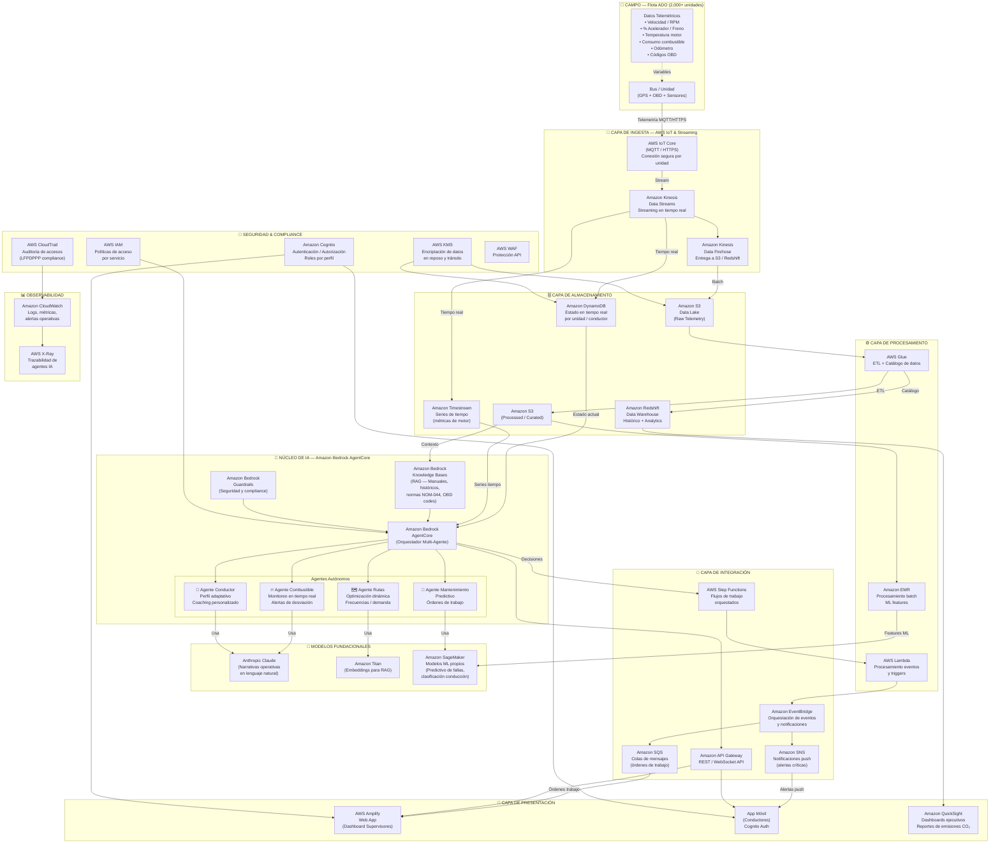

# ADO Intelligence Platform — Arquitectura AWS
## Hackathon ITP LATAM | Working Backwards con Amazon Bedrock AgentCore

---

## 🏗️ DIAGRAMA DE ARQUITECTURA AWS (Texto/Mermaid)



---

## 📋 DESCRIPCIÓN DE COMPONENTES Y FLUJO DE DATOS

### 1. CAPA DE CAMPO (Edge)
| Componente | Descripción |
|---|---|
| **Bus / Unidad** | 2,000+ autobuses con GPS embarcado existente + módulo OBD |
| **Variables capturadas** | Velocidad, RPM, % acelerador, % freno, temperatura motor, consumo combustible, odómetro, códigos de diagnóstico OBD |

### 2. CAPA DE INGESTA
| Servicio AWS | Rol | Justificación |
|---|---|---|
| **AWS IoT Core** | Punto de entrada seguro para telemetría | Maneja millones de conexiones MQTT simultáneas, certificados TLS por unidad |
| **Amazon Kinesis Data Streams** | Streaming en tiempo real | Procesa telemetría de 2,000 buses en tiempo real con latencia < 1 seg |
| **Amazon Kinesis Data Firehose** | Entrega automática a almacenamiento | Carga datos a S3 y Redshift sin código adicional |

### 3. CAPA DE ALMACENAMIENTO
| Servicio AWS | Rol | Justificación |
|---|---|---|
| **Amazon S3** | Data Lake (raw + procesado) | Almacenamiento escalable y económico para telemetría histórica |
| **Amazon DynamoDB** | Estado en tiempo real | Latencia < 10ms para consultas del estado actual de cada unidad |
| **Amazon Timestream** | Series de tiempo de motor | Optimizado para datos temporales de sensores (temperatura, RPM) |
| **Amazon Redshift** | Data Warehouse analítico | Consultas complejas sobre histórico de flota, rutas y conductores |

### 4. CAPA DE PROCESAMIENTO
| Servicio AWS | Rol | Justificación |
|---|---|---|
| **AWS Glue** | ETL + Catálogo de datos | Transforma datos raw en features para ML y analytics |
| **AWS Lambda** | Procesamiento serverless de eventos | Triggers en tiempo real para alertas y notificaciones |
| **Amazon EMR** | Procesamiento batch a escala | Entrenamiento de modelos ML con histórico completo de flota |

### 5. NÚCLEO DE IA — Amazon Bedrock AgentCore ⭐
| Componente | Rol | Descripción |
|---|---|---|
| **Bedrock AgentCore** | Orquestador multi-agente | Coordina los 4 agentes autónomos, gestiona memoria y contexto |
| **Agente Combustible** | Motor de inteligencia de combustible | Monitorea desviaciones en tiempo real, genera alertas accionables |
| **Agente Mantenimiento** | Mantenimiento predictivo | Analiza señales OBD, genera órdenes de trabajo preventivas |
| **Agente Conductor** | Perfil adaptativo | Construye huella de eficiencia individual, genera coaching en lenguaje natural |
| **Agente Rutas** | Optimización dinámica | Calibra frecuencias según demanda real con horizonte de 72 horas |
| **Knowledge Bases** | RAG contextual | Manuales técnicos, normas NOM-044, histórico de fallas, códigos OBD |
| **Guardrails** | Seguridad y compliance | Previene respuestas inapropiadas, protege datos de conductores (LFPDPPP) |

### 6. MODELOS FUNDACIONALES
| Modelo | Uso | Justificación |
|---|---|---|
| **Anthropic Claude** | Narrativas operativas en español | Genera recomendaciones en lenguaje natural para supervisores y conductores |
| **Amazon Titan Embeddings** | RAG para Knowledge Bases | Búsqueda semántica en manuales técnicos y histórico de fallas |
| **Amazon SageMaker** | Modelos ML propios | Predicción de fallas (clasificación), scoring de eficiencia de conducción |

### 7. CAPA DE INTEGRACIÓN
| Servicio AWS | Rol |
|---|---|
| **Amazon API Gateway** | Expone APIs REST/WebSocket para apps web y móvil |
| **Amazon EventBridge** | Orquesta eventos entre agentes y sistemas externos (ERP, taller) |
| **Amazon SNS** | Notificaciones push críticas (alerta de falla inminente) |
| **Amazon SQS** | Cola de órdenes de trabajo para talleres |
| **AWS Step Functions** | Flujos de trabajo complejos (proceso de mantenimiento predictivo end-to-end) |

### 8. CAPA DE PRESENTACIÓN
| Servicio AWS | Usuario | Funcionalidad |
|---|---|---|
| **AWS Amplify** | Supervisores de flota | Dashboard en tiempo real, alertas, órdenes de trabajo |
| **App Móvil + Cognito** | Conductores | Retroalimentación de conducción, coaching personalizado |
| **Amazon QuickSight** | Dirección / Finanzas | Dashboards ejecutivos, reportes de emisiones CO₂ auditables |

### 9. SEGURIDAD & COMPLIANCE
| Servicio AWS | Rol | Regulación cubierta |
|---|---|---|
| **Amazon Cognito** | Autenticación con roles (Director, Supervisor, Conductor) | LFPDPPP |
| **AWS IAM** | Políticas de acceso mínimo por servicio | Seguridad interna |
| **AWS KMS** | Encriptación de datos en reposo y tránsito | LFPDPPP, NOM-044 |
| **AWS CloudTrail** | Auditoría completa de accesos y operaciones | LFPDPPP, auditorías ambientales |
| **AWS WAF** | Protección de APIs contra ataques | Seguridad perimetral |

---

## 🔄 FLUJO DE DATOS PRINCIPAL (Narrativa)

```
1. CAPTURA
   Bus → [GPS/OBD] → AWS IoT Core (MQTT/TLS)

2. STREAMING
   IoT Core → Kinesis Data Streams → DynamoDB (estado real-time)
                                   → Timestream (series de tiempo)
                                   → Kinesis Firehose → S3 (raw)

3. PROCESAMIENTO
   S3 raw → AWS Glue (ETL) → S3 processed + Redshift
   S3 processed → EMR → SageMaker (entrenamiento modelos ML)

4. INTELIGENCIA (CORE)
   DynamoDB + Timestream + Knowledge Bases
        ↓
   Amazon Bedrock AgentCore (Orquestador)
        ↓
   ┌─────────────────────────────────────────┐
   │  Agente Combustible  → Claude → Alerta  │
   │  Agente Mantenimiento → SageMaker → OT  │
   │  Agente Conductor    → Claude → Coaching│
   │  Agente Rutas        → Titan  → Ajuste  │
   └─────────────────────────────────────────┘

5. ACCIÓN
   Bedrock AgentCore → Step Functions → Lambda
                                      → EventBridge → SNS (push alert)
                                                    → SQS (orden taller)
                                                    → API Gateway

6. PRESENTACIÓN
   API Gateway → Amplify (Supervisores)
              → App Móvil (Conductores)
   Redshift   → QuickSight (Dirección / Reportes CO₂)
```

---

## 📝 SERVICIOS AWS REQUERIDOS — LISTA PARA SOLICITUD DE PERMISOS

Esta es la lista completa de servicios que el equipo necesita que los administradores de la cuenta AWS de Mobility ADO habiliten:

### 🔴 CRÍTICOS (Hackathon no puede iniciar sin estos)
1. **Amazon Bedrock** — Acceso a modelos fundacionales (Claude, Titan) + AgentCore
2. **Amazon Bedrock AgentCore** — Orquestación de agentes autónomos
3. **Amazon Bedrock Knowledge Bases** — RAG con documentos técnicos
4. **Amazon Bedrock Guardrails** — Seguridad y compliance de respuestas IA
5. **AWS IoT Core** — Ingesta de telemetría de flota
6. **Amazon Kinesis Data Streams** — Streaming en tiempo real
7. **Amazon S3** — Data Lake y almacenamiento general
8. **AWS Lambda** — Procesamiento serverless
9. **Amazon DynamoDB** — Base de datos en tiempo real
10. **Amazon API Gateway** — Exposición de APIs

### 🟡 IMPORTANTES (Necesarios para funcionalidad completa)
11. **Amazon Kinesis Data Firehose** — Entrega automática a almacenamiento
12. **Amazon Timestream** — Series de tiempo de sensores
13. **Amazon Redshift** — Data Warehouse analítico
14. **AWS Glue** — ETL y catálogo de datos
15. **Amazon SageMaker** — Modelos ML propios (mantenimiento predictivo)
16. **AWS Step Functions** — Orquestación de flujos de trabajo
17. **Amazon EventBridge** — Orquestación de eventos
18. **Amazon SNS** — Notificaciones push
19. **Amazon SQS** — Colas de mensajes
20. **AWS Amplify** — Frontend web

### 🟢 COMPLEMENTARIOS (Seguridad, observabilidad y presentación)
21. **Amazon Cognito** — Autenticación y autorización
22. **AWS IAM** — Gestión de roles y políticas
23. **AWS KMS** — Encriptación de datos
24. **AWS CloudTrail** — Auditoría de accesos
25. **AWS WAF** — Protección de APIs
26. **Amazon CloudWatch** — Monitoreo y logs
27. **AWS X-Ray** — Trazabilidad de agentes IA
28. **Amazon QuickSight** — Dashboards ejecutivos y reportes CO₂
29. **Amazon EMR** — Procesamiento batch a escala
30. **AWS Cognito** — Autenticación app móvil conductores

---

## 📧 INFORMACIÓN PARA SOLICITUD DE PERMISOS A ADMINS DE AWS (Mobility ADO)

**Asunto:** Solicitud de habilitación de servicios AWS — Hackathon ITP LATAM | ADO Intelligence Platform

**Para:** Administradores de cuenta AWS — Mobility ADO

**De:** Equipo de Hackathon ITP LATAM

---

**Contexto del proyecto:**
Estamos desarrollando **ADO Intelligence Platform**, un sistema autónomo de optimización de flotas impulsado por agentes de IA usando **Amazon Bedrock AgentCore**. El sistema analiza datos telemétricos de autobuses en tiempo real para:
- Reducir consumo de combustible (objetivo: 8-15%)
- Anticipar mantenimiento preventivo (objetivo: 75-85% de fallas anticipadas)
- Estandarizar conducción eficiente entre conductores
- Generar reportes verificables de reducción de emisiones CO₂

**Región AWS recomendada:** `us-east-1` (N. Virginia) — mayor disponibilidad de servicios Bedrock

**Tipo de cuenta:** Cuenta de desarrollo/hackathon (no producción)

**Servicios requeridos:** Ver lista completa en sección anterior (30 servicios)

**Permisos IAM mínimos necesarios por el equipo:**
- `AmazonBedrockFullAccess`
- `AmazonDynamoDBFullAccess`
- `AmazonKinesisFullAccess`
- `AmazonS3FullAccess`
- `AWSIoTFullAccess`
- `AWSLambdaFullAccess`
- `AmazonAPIGatewayAdministrator`
- `AmazonSageMakerFullAccess`
- `AWSGlueConsoleFullAccess`
- `AmazonRedshiftFullAccess`
- `AmazonTimestreamFullAccess`
- `AWSStepFunctionsFullAccess`
- `AmazonEventBridgeFullAccess`
- `AmazonSNSFullAccess`
- `AmazonSQSFullAccess`
- `AWSAmplifyAdminAccess`
- `AmazonCognitoPowerUser`
- `AWSKeyManagementServicePowerUser`
- `AmazonQuickSightFullAccess`
- `CloudWatchFullAccess`
- `AWSXRayFullAccess`

**Estimado de costos (hackathon, 72 horas):** < $500 USD con uso moderado de Bedrock

---

*Documento generado para el Hackathon ITP LATAM — ADO Intelligence Platform*
*Basado en el framework Working Backwards de Amazon*
