```mermaid
flowchart TB
    %% ============================================================
    %% CLIENTES / USUARIOS FINALES
    %% ============================================================
    subgraph CLIENTES["👥 USUARIOS FINALES"]
        direction LR
        USR_DIR["🏢 Director de Operaciones\n(Web Browser)"]
        USR_SUP["👷 Supervisor de Flota\n(Web Browser)"]
        USR_COND["🚌 Conductor\n(Mobile App)"]
        USR_TALLER["🔧 Taller Mecánico\n(Web Browser)"]
    end

    %% ============================================================
    %% ORIGEN DE DATOS — GCP (fuera de AWS)
    %% ============================================================
    subgraph GCP["☁️ GOOGLE CLOUD PLATFORM (Origen de datos históricos)"]
        direction LR
        GCP_BQ["BigQuery\n(Telemetría histórica)"]
        GCP_GCS["Cloud Storage\n(Archivos CSV/Parquet)"]
        GCP_BQ --> GCP_GCS
    end

    %% ============================================================
    %% AWS CLOUD — REGIÓN us-east-1
    %% ============================================================
    subgraph AWS["☁️ AWS CLOUD — us-east-1 (N. Virginia)"]
        direction TB

        %% ----------------------------------------------------------
        %% CAPA DE SEGURIDAD PERIMETRAL
        %% ----------------------------------------------------------
        subgraph SEC_PERIMETER["🔐 SEGURIDAD & IDENTIDAD"]
            direction LR
            IAM["AWS IAM\nRoles & Políticas\npor servicio"]
            CW["Amazon CloudWatch\nLogs & Métricas\nAlarmas"]
        end

        %% ----------------------------------------------------------
        %% VPC — RED PRIVADA
        %% ----------------------------------------------------------
        subgraph VPC["🌐 Amazon VPC — 10.0.0.0/16"]
            direction TB

            subgraph PUBLIC_SUBNET["📡 Subred Pública — 10.0.1.0/24"]
                APIGW["Amazon API Gateway\nREST API\n(HTTPS / TLS 1.2+)\n/agents/{agentId}/invoke\n/dashboard/data\n/alertas"]
            end

            subgraph PRIVATE_SUBNET_APP["⚙️ Subred Privada App — 10.0.2.0/24"]
                direction TB

                subgraph LAMBDAS["λ AWS Lambda Functions"]
                    direction LR
                    LMB_SIM["λ ado-simulador-telemetria\n(Simula ingesta tiempo real)\nTrigger: EventBridge cada 10s\nRuntime: Python 3.12\n512 MB / 30s timeout"]
                    LMB_T1["λ tool-consultar-telemetria\n(Lee DynamoDB → Agente)\nRuntime: Python 3.12\n256 MB / 10s timeout"]
                    LMB_T2["λ tool-calcular-desviacion\n(Calcula % vs umbral S3)\nRuntime: Python 3.12\n256 MB / 10s timeout"]
                    LMB_T3["λ tool-listar-buses-activos\n(Query DynamoDB GSI)\nRuntime: Python 3.12\n256 MB / 10s timeout"]
                    LMB_T4["λ tool-consultar-obd\n(Lee señales OBD DynamoDB)\nRuntime: Python 3.12\n256 MB / 10s timeout"]
                    LMB_T5["λ tool-predecir-falla\n(Invoca SageMaker endpoint)\nRuntime: Python 3.12\n256 MB / 30s timeout"]
                    LMB_T6["λ tool-buscar-historial-fallas\n(Query S3 Parquet via Athena)\nRuntime: Python 3.12\n512 MB / 30s timeout"]
                    LMB_T7["λ tool-generar-orden-trabajo\n(Escribe DynamoDB ado-alertas)\nRuntime: Python 3.12\n256 MB / 10s timeout"]
                    LMB_DASH["λ ado-dashboard-api\n(Sirve datos a QuickSight/UI)\nRuntime: Python 3.12\n256 MB / 15s timeout"]
                end

                EB_SCHED["Amazon EventBridge\nScheduler\nRate: every 10 seconds\n(Trigger simulador)"]
            end

            subgraph PRIVATE_SUBNET_DATA["🗄️ Subred Privada Datos — 10.0.3.0/24"]
                direction TB

                subgraph DYNAMODB_TABLES["Amazon DynamoDB"]
                    DDB_TELE["Tabla: ado-telemetria-live\nPK: bus_id | SK: timestamp\nGSI: ruta_id-timestamp-index\nTTL: 24h\nCapacidad: On-Demand"]
                    DDB_ALERT["Tabla: ado-alertas\nPK: alerta_id | SK: timestamp\nGSI: bus_id-index\nCapacidad: On-Demand"]
                end

                subgraph S3_BUCKETS["Amazon S3 — Data Lake"]
                    S3_TELE["s3://ado-intelligence-mvp/\ntelemetria-historica/\n(Parquet — datos GCP)"]
                    S3_FALLAS["s3://ado-intelligence-mvp/\nfallas-historicas/\n(Parquet — historial)"]
                    S3_KB["s3://ado-intelligence-mvp/\nknowledge-base/docs/\n(PDF, CSV — manuales OBD\nnormas NOM-044)"]
                    S3_MODEL["s3://ado-intelligence-mvp/\nmodelos/sagemaker/\n(Training data Parquet)"]
                end
            end

            subgraph PRIVATE_SUBNET_ML["🤖 Subred Privada ML — 10.0.4.0/24"]
                direction TB

                subgraph SAGEMAKER["Amazon SageMaker"]
                    SM_STUDIO["SageMaker Studio\n(Entrenamiento modelo\nXGBoost / Random Forest)"]
                    SM_EP["SageMaker Endpoint\nado-prediccion-fallas\nml.m5.large\nPredictor: falla_14_dias\nOutput: probabilidad 0-1"]
                    SM_STUDIO -->|"Deploy"| SM_EP
                end
            end
        end

        %% ----------------------------------------------------------
        %% AMAZON BEDROCK — SERVICIO MANAGED (fuera de VPC)
        %% ----------------------------------------------------------
        subgraph BEDROCK["🧠 AMAZON BEDROCK (Managed Service)"]
            direction TB

            subgraph AGENTCORE["Amazon Bedrock AgentCore — Orquestador"]
                direction LR

                subgraph AGENT1["🔥 Agente: ado-agente-combustible"]
                    A1_CORE["AgentCore\nModelo: Claude 3.5 Sonnet\nMemoria: Session-based\nMax tokens: 4096"]
                    A1_AG["Action Group\nado-combustible-tools\n• consultar_telemetria\n• calcular_desviacion\n• listar_buses_activos"]
                end

                subgraph AGENT2["🔧 Agente: ado-agente-mantenimiento"]
                    A2_CORE["AgentCore\nModelo: Claude 3.5 Sonnet\nMemoria: Session-based\nMax tokens: 4096"]
                    A2_AG["Action Group\nado-mantenimiento-tools\n• consultar_obd\n• predecir_falla\n• buscar_historial_fallas\n• generar_orden_trabajo"]
                end
            end

            subgraph BEDROCK_SERVICES["Servicios Bedrock de Soporte"]
                direction LR
                KB["Bedrock Knowledge Bases\nado-kb-flota\nEmbeddings: Titan Text v2\nVector Store: OpenSearch\nData Source: S3"]
                GR["Bedrock Guardrails\nado-guardrails\n• Filtro contenido\n• PII protection\n• Idioma: ES"]
                CLAUDE["Anthropic Claude 3.5 Sonnet\nanthropic.claude-3-5-sonnet\n-20241022-v2:0\n(Foundation Model)"]
                TITAN["Amazon Titan\nText Embeddings v2\n(Embeddings para RAG)"]
            end
        end

        %% ----------------------------------------------------------
        %% CAPA DE PRESENTACIÓN
        %% ----------------------------------------------------------
        subgraph PRESENTATION["📊 CAPA DE PRESENTACIÓN"]
            direction LR
            QS["Amazon QuickSight\nDashboard Ejecutivo\n• Mapa flota activa\n• Top 10 buses alerta\n• Ahorro MXN acumulado\n• CO₂ reducido (ton)\n• OTs activas"]
            ATHENA["Amazon Athena\n(Query S3 Parquet\npara QuickSight)"]
        end

    end

    %% ============================================================
    %% FLOTA ADO — EDGE (fuera de AWS)
    %% ============================================================
    subgraph FLOTA["🚌 FLOTA ADO — Campo (Simulado en MVP)"]
        direction LR
        BUS1["Bus BUS-247\nRuta: MEX-PUE\nGPS + OBD"]
        BUS2["Bus BUS-089\nRuta: MEX-QRO\nGPS + OBD"]
        BUS3["Bus BUS-N...\n(2,000+ unidades)\nGPS + OBD"]
    end

    %% ============================================================
    %% CONEXIONES — FLUJO DE DATOS
    %% ============================================================

    %% GCP → AWS Migración
    GCP_GCS -->|"aws s3 cp / Storage Transfer\n(Migración Día 1 — HTTPS)"| S3_TELE
    GCP_GCS -->|"Migración histórico fallas"| S3_FALLAS
    GCP_GCS -->|"Docs knowledge base"| S3_KB

    %% Flota → Simulador (en MVP los buses son simulados)
    FLOTA -.->|"En producción: MQTT/TLS\nEn MVP: datos históricos S3"| LMB_SIM

    %% EventBridge → Lambda Simulador
    EB_SCHED -->|"Trigger cada 10s"| LMB_SIM

    %% Lambda Simulador → DynamoDB
    LMB_SIM -->|"Lee registros históricos"| S3_TELE
    LMB_SIM -->|"PutItem — estado live"| DDB_TELE

    %% Usuarios → API Gateway
    USR_DIR -->|"HTTPS"| APIGW
    USR_SUP -->|"HTTPS"| APIGW
    USR_COND -->|"HTTPS"| APIGW
    USR_TALLER -->|"HTTPS"| APIGW

    %% API Gateway → Lambda Dashboard
    APIGW -->|"GET /dashboard/data"| LMB_DASH
    APIGW -->|"POST /agents/combustible/invoke"| A1_CORE
    APIGW -->|"POST /agents/mantenimiento/invoke"| A2_CORE

    %% Agente Combustible → Tools
    A1_AG -->|"Invoke Lambda"| LMB_T1
    A1_AG -->|"Invoke Lambda"| LMB_T2
    A1_AG -->|"Invoke Lambda"| LMB_T3
    A1_CORE -->|"RAG Query"| KB
    A1_CORE -->|"Guardrails check"| GR
    A1_CORE -->|"Generate"| CLAUDE

    %% Agente Mantenimiento → Tools
    A2_AG -->|"Invoke Lambda"| LMB_T4
    A2_AG -->|"Invoke Lambda"| LMB_T5
    A2_AG -->|"Invoke Lambda"| LMB_T6
    A2_AG -->|"Invoke Lambda"| LMB_T7
    A2_CORE -->|"RAG Query"| KB
    A2_CORE -->|"Guardrails check"| GR
    A2_CORE -->|"Generate"| CLAUDE

    %% Tools → DynamoDB
    LMB_T1 -->|"Query"| DDB_TELE
    LMB_T2 -->|"Query"| DDB_TELE
    LMB_T3 -->|"Query GSI"| DDB_TELE
    LMB_T4 -->|"Query"| DDB_TELE
    LMB_T7 -->|"PutItem"| DDB_ALERT

    %% Tools → S3
    LMB_T2 -->|"GetObject umbrales"| S3_TELE
    LMB_T6 -->|"Query via Athena"| ATHENA
    ATHENA -->|"Scan Parquet"| S3_FALLAS

    %% Tools → SageMaker
    LMB_T5 -->|"InvokeEndpoint"| SM_EP

    %% Knowledge Base → S3
    KB -->|"Index documents"| S3_KB
    KB -->|"Embeddings"| TITAN

    %% SageMaker → S3
    SM_STUDIO -->|"Read training data"| S3_MODEL

    %% Dashboard
    LMB_DASH -->|"Query"| DDB_TELE
    LMB_DASH -->|"Query"| DDB_ALERT
    QS -->|"Query"| ATHENA
    ATHENA -->|"Scan"| S3_TELE

    %% IAM protege todo
    IAM -.->|"Execution Role"| LMB_SIM
    IAM -.->|"Execution Role"| LMB_T1
    IAM -.->|"Bedrock Role"| A1_CORE
    IAM -.->|"Bedrock Role"| A2_CORE
    IAM -.->|"SageMaker Role"| SM_EP

    %% CloudWatch observa todo
    CW -.->|"Logs"| LMB_SIM
    CW -.->|"Logs"| A1_CORE
    CW -.->|"Logs"| A2_CORE
    CW -.->|"Metrics"| SM_EP

    %% ============================================================
    %% ESTILOS
    %% ============================================================
    classDef gcpStyle fill:#4285F4,stroke:#1a73e8,color:#fff,rx:8
    classDef awsOrange fill:#FF9900,stroke:#e88a00,color:#fff,rx:8
    classDef lambdaStyle fill:#FF9900,stroke:#cc7a00,color:#fff,rx:4
    classDef dynamoStyle fill:#4053D6,stroke:#2d3bb5,color:#fff,rx:8
    classDef s3Style fill:#3F8624,stroke:#2d6119,color:#fff,rx:8
    classDef bedrockStyle fill:#8B5CF6,stroke:#6d3fd4,color:#fff,rx:8
    classDef sagemakerStyle fill:#00A591,stroke:#007a6b,color:#fff,rx:8
    classDef userStyle fill:#1A1A2E,stroke:#16213e,color:#fff,rx:12
    classDef busStyle fill:#E63946,stroke:#c1121f,color:#fff,rx:8
    classDef secStyle fill:#6B7280,stroke:#4b5563,color:#fff,rx:8
    classDef presentStyle fill:#0EA5E9,stroke:#0284c7,color:#fff,rx:8

    class GCP_BQ,GCP_GCS gcpStyle
    class APIGW,EB_SCHED awsOrange
    class LMB_SIM,LMB_T1,LMB_T2,LMB_T3,LMB_T4,LMB_T5,LMB_T6,LMB_T7,LMB_DASH lambdaStyle
    class DDB_TELE,DDB_ALERT dynamoStyle
    class S3_TELE,S3_FALLAS,S3_KB,S3_MODEL s3Style
    class A1_CORE,A2_CORE,A1_AG,A2_AG,KB,GR,CLAUDE,TITAN bedrockStyle
    class SM_STUDIO,SM_EP sagemakerStyle
    class USR_DIR,USR_SUP,USR_COND,USR_TALLER userStyle
    class BUS1,BUS2,BUS3 busStyle
    class IAM,CW secStyle
    class QS,ATHENA presentStyle
```

# ADO Intelligence Platform — Diagrama de Arquitectura Completo
## Para importar en draw.io: Extras → Edit Diagram → pegar el bloque Mermaid

---

---

## Instrucciones para draw.io

1. Abre [draw.io](https://app.diagrams.net) o la app de escritorio
2. Crea un nuevo diagrama en blanco
3. Ve a **Extras → Edit Diagram** (o Ctrl+Shift+X)
4. Borra el contenido existente
5. Pega **solo el bloque mermaid** (desde `flowchart TB` hasta el último `classDef`)
6. Haz clic en **OK** — draw.io renderizará el diagrama automáticamente
7. Usa **Arrange → Layout** para reorganizar si es necesario

## Capas del diagrama

| Capa | Color | Descripción |
|---|---|---|
| 🔵 GCP | Azul Google | Origen de datos históricos (BigQuery, GCS) |
| 🟠 AWS Core | Naranja AWS | API Gateway, EventBridge |
| 🟠 Lambda | Naranja oscuro | 9 funciones Lambda (simulador + 7 tools + dashboard) |
| 🔵 DynamoDB | Azul índigo | 2 tablas (telemetría live + alertas) |
| 🟢 S3 | Verde | 4 prefijos del Data Lake |
| 🟣 Bedrock | Violeta | AgentCore, Knowledge Bases, Claude, Titan, Guardrails |
| 🩵 SageMaker | Verde azulado | Studio + Endpoint de predicción |
| ⚫ Usuarios | Negro | 4 tipos de usuario final |
| 🔴 Flota | Rojo | Buses ADO (simulados en MVP) |
| ⚫ Seguridad | Gris | IAM + CloudWatch |
| 🔵 Presentación | Azul cielo | QuickSight + Athena |
