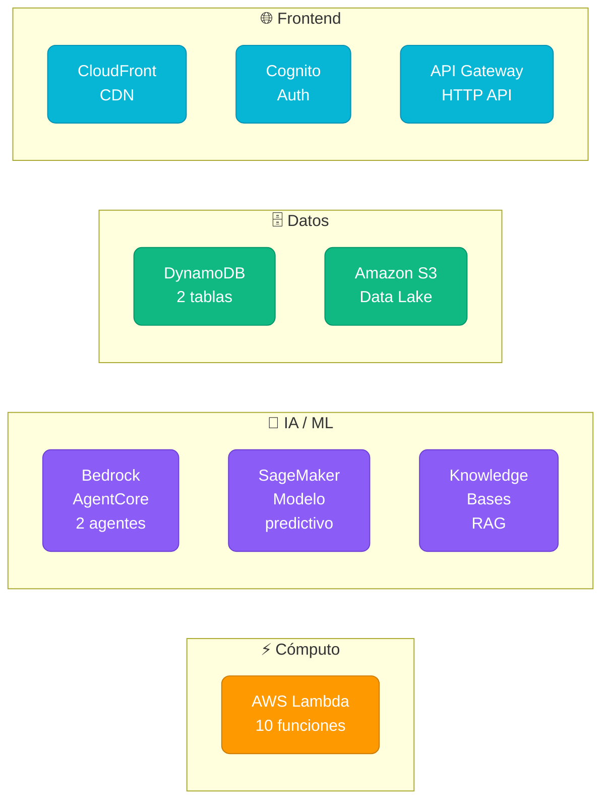

```mermaid
flowchart TB
    %% ============================================================
    %% FUENTES DE DATOS
    %% ============================================================
    subgraph DATOS["📡 DATOS DE FLOTA (Simulados)"]
        direction LR
        GPS["🛰️ GPS\nUbicación en\ntiempo real"]
        SENSORES["⚙️ 27 Sensores\nMotor, frenos,\ncombustible"]
        FALLAS["⚠️ Códigos\nde falla\nhistóricos"]
    end

    %% ============================================================
    %% INGESTA
    %% ============================================================
    SIMULADOR["🔄 Simulador de Telemetría\nInyecta datos cada 10 segundos\n3 buses en ruta México–Acapulco"]

    %% ============================================================
    %% ALMACENAMIENTO
    %% ============================================================
    subgraph STORAGE["☁️ ALMACENAMIENTO AWS"]
        direction LR
        DYNAMO["⚡ Estado en\nTiempo Real\n(DynamoDB)"]
        S3["📦 Data Lake\nHistóricos +\nCatálogos\n(Amazon S3)"]
    end

    %% ============================================================
    %% INTELIGENCIA
    %% ============================================================
    subgraph IA["🧠 INTELIGENCIA ARTIFICIAL"]
        direction TB

        subgraph AGENTES["Amazon Bedrock AgentCore — 2 Agentes Autónomos"]
            direction LR
            COMBUSTIBLE["🔥 Agente de\nCombustible\n─────────\nDetecta desviaciones\nde consumo por bus\ny conductor"]
            MANTENIMIENTO["🔧 Agente de\nMantenimiento\n─────────\nPredice fallas\nmecánicas antes\nde que ocurran"]
        end

        subgraph SOPORTE["Servicios de Soporte IA"]
            direction LR
            CLAUDE["💬 Claude 3.5\nSonnet\n(Lenguaje\nnatural)"]
            ML["📊 Modelo\nPredictivo\nXGBoost\n(SageMaker)"]
            KB["📚 Base de\nConocimiento\nManuales +\nNormas"]
        end
    end

    %% ============================================================
    %% DASHBOARD
    %% ============================================================
    subgraph DASHBOARD["📱 DASHBOARD — React"]
        direction LR
        MAPA["🗺️ Mapa\nen Vivo"]
        ALERTAS["🔔 Alertas\ny OTs"]
        EFICIENCIA["⛽ Eficiencia\nde Flota"]
        AMBIENTAL["🌿 Impacto\nAmbiental"]
        CHAT["💬 Chat\ncon IA"]
    end

    %% ============================================================
    %% USUARIOS
    %% ============================================================
    subgraph USUARIOS["👥 USUARIOS"]
        direction LR
        DIRECTOR["🏢 Director\nde Operaciones"]
        SUPERVISOR["👷 Supervisor\nde Flota"]
        TALLER["🔧 Jefe de\nTaller"]
    end

    %% ============================================================
    %% CONEXIONES
    %% ============================================================
    DATOS --> SIMULADOR
    SIMULADOR --> STORAGE
    STORAGE --> IA
    AGENTES --> SOPORTE
    IA --> DASHBOARD
    DASHBOARD --> USUARIOS

    %% ============================================================
    %% ESTILOS
    %% ============================================================
    classDef datosStyle fill:#3B82F6,stroke:#2563EB,color:#fff,rx:10
    classDef simStyle fill:#F59E0B,stroke:#D97706,color:#fff,rx:10
    classDef storageStyle fill:#10B981,stroke:#059669,color:#fff,rx:10
    classDef iaStyle fill:#8B5CF6,stroke:#7C3AED,color:#fff,rx:10
    classDef dashStyle fill:#06B6D4,stroke:#0891B2,color:#fff,rx:10
    classDef userStyle fill:#1E293B,stroke:#0F172A,color:#fff,rx:12
    classDef soporteStyle fill:#A78BFA,stroke:#7C3AED,color:#fff,rx:8

    class GPS,SENSORES,FALLAS datosStyle
    class SIMULADOR simStyle
    class DYNAMO,S3 storageStyle
    class COMBUSTIBLE,MANTENIMIENTO iaStyle
    class CLAUDE,ML,KB soporteStyle
    class MAPA,ALERTAS,EFICIENCIA,AMBIENTAL,CHAT dashStyle
    class DIRECTOR,SUPERVISOR,TALLER userStyle
```

# ADO MobilityIA — Arquitectura Simplificada
## Para Stakeholders — Hackathon AWS Builders League 2026

> Diagrama de alto nivel que muestra el flujo de datos y valor de la plataforma.
> Los datos son **simulados** (C-004). Los agentes son de **Amazon Bedrock AgentCore** (C-005).

---



---

## Flujo de Valor

```
  DATOS          →    ALMACENAMIENTO    →    INTELIGENCIA IA    →    DECISIONES
  ─────              ──────────────         ────────────────        ──────────
  27 sensores         DynamoDB              2 Agentes autónomos     Alertas en
  por bus             (tiempo real)         Claude 3.5 Sonnet       tiempo real
                                            +                       +
  GPS en              Amazon S3             Modelo predictivo       Órdenes de
  tiempo real         (históricos)          XGBoost (SageMaker)     trabajo
                                            +                       +
  Códigos de                                Base de conocimiento    Recomendaciones
  falla                                     (manuales + normas)     accionables
```

---

## Servicios AWS Utilizados



---

## Resultados Esperados (Lenguaje Difuso — C-003)

| Área | Antes | Con ADO MobilityIA |
|---|---|---|
| **Combustible** | Sin visibilidad granular por bus/conductor | Detección automática de desviaciones con causa raíz |
| **Mantenimiento** | Reactivo — fallas en ruta | Predictivo — anticipación de eventos mecánicos |
| **Disponibilidad** | Unidades fuera de servicio sin aviso | Mayor disponibilidad por intervención preventiva |
| **Ambiental** | Sin métricas de emisiones | Estimación de reducción de CO₂ por optimización |

---

## Stack Tecnológico Resumido

| Capa | Tecnología |
|---|---|
| **Frontend** | React + Tailwind + Leaflet (mapa) |
| **Auth** | Amazon Cognito (JWT) |
| **API** | Amazon API Gateway (HTTP) |
| **Agentes IA** | Amazon Bedrock AgentCore + Claude 3.5 Sonnet |
| **ML Predictivo** | Amazon SageMaker (XGBoost) |
| **RAG** | Amazon Bedrock Knowledge Bases |
| **Datos** | Amazon DynamoDB + Amazon S3 |
| **Cómputo** | AWS Lambda (Python 3.12) |
| **CDN** | Amazon CloudFront |
